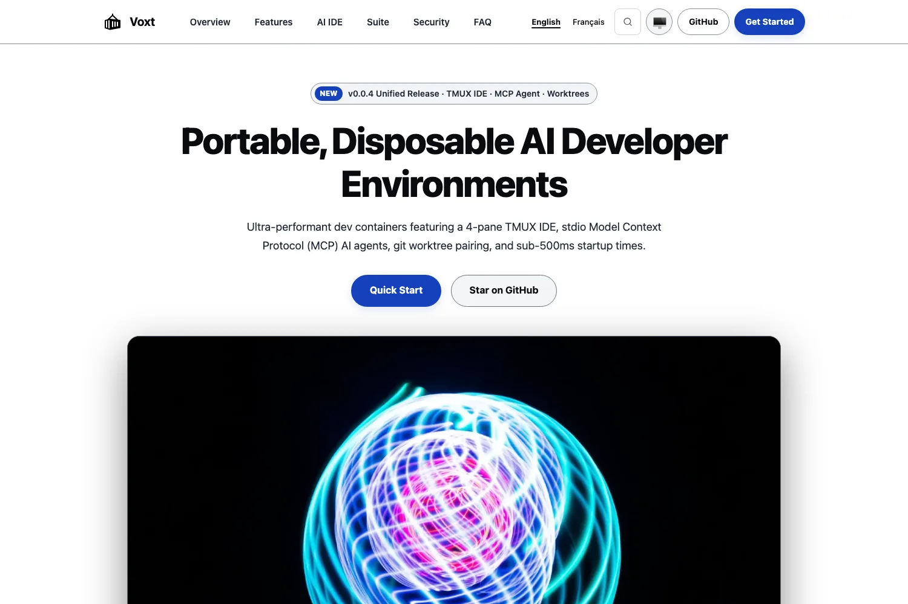

<!-- SPDX-License-Identifier: Apache-2.0 OR MIT -->

<p align="center">
  
</p>

<h1 align="center">crypto-service.github.io</h1>

<p align="center">
  Official website for Crypto Service Suite, the sovereign post-quantum cryptographic infrastructure.
</p>

<p align="center">
  <a href="https://github.com/sebastienrousseau/crypto-service.github.io/actions/workflows/deploy.yml"></a>
  <a href="https://crypto-service.co"></a>
  <a href="https://docs.crypto-service.co"></a>
  <a href="https://github.com/sebastienrousseau/crypto-service/releases"></a>
  <a href="https://static-site-generator.com/"></a>
  <a href="LICENSE-APACHE"></a>
</p>

<p align="center">
  
</p>

---

## Contents

**Getting started**

- [Install](#install) — cargo install and clone setup
- [Requirements](#requirements) — toolchain floor, platforms
- [Quick Start](#quick-start) — build and serve locally in minutes

**The crypto-service.github.io ecosystem**

- [The crypto-service.github.io ecosystem](#the-crypto-servicegithubio-ecosystem) — web architecture, components, and package references

**Library reference**

- [Capabilities at a glance](#capabilities-at-a-glance) — current static site generator capabilities
- [Ecosystem comparison](#ecosystem-comparison) — comparison against standard site setups
- [Benchmarks](#benchmarks) — compilation speed and Lighthouse scores
- [Features](#features) — static site capabilities and styling system
- [Configuration](#configuration) — ssg.toml options
- [Examples](#examples) — runnable commands and local workflows

**Operational**

- [When not to use crypto-service.github.io](#when-not-to-use-crypto-servicegithubio) — operational boundaries and non-goals
- [Development](#development) — make targets, build pipeline, and CI
- [Security](#security) — guarantees and compliance
- [Documentation](#documentation) — reference documentation
- [Stability guarantees](#stability-guarantees) — release policy and compatibility
- [License](#license)

---

## Install

### As a static web project

Clone the repository and verify build tooling:

```bash
git clone https://github.com/sebastienrousseau/crypto-service.github.io.git
cd crypto-service.github.io
```

Install the Rust-based Static Site Generator (SSG):

```bash
cargo install ssg
```

| Method | Command / Steps |
| :--- | :--- |
| **Cargo** | `cargo install ssg` |
| **From source** | `git clone https://github.com/sebastienrousseau/crypto-service.github.io.git` |
| **Make** | `make build` |

---

## Requirements

- **Rust toolchain**: 1.80+ (for compiling `ssg` from source, if applicable)
- **SSG**: 0.0.63 or newer
- **Make**: GNU Make 3.81+
- **Browser target**: Modern evergreen browsers supporting CSS Grid, flexbox, and ES2022

---

## Quick Start

```bash
# Build the static site into public/
make build

# Audit generated pages
make audit

# Serve locally
make serve
```

The site compiles markdown files in `content/` through templates in `_layouts/` into optimized static HTML, CSS, and SVG assets in `public/`.

---

## The crypto-service.github.io ecosystem

`crypto-service.github.io` serves as the public website and presentation layer for the Crypto Service Suite at [https://crypto-service.co](https://crypto-service.co).

| Component | Purpose | Use case |
| :--- | :--- | :--- |
| `_layouts/` | HTML templates and Skeletonic CSS styling | Base layout, navigation header, footer, and submenus |
| `content/` | Markdown page content and whitepapers | Product overviews, architecture, solutions, and benchmarks |
| `images/` | Optimized WebP illustrations and SVG icons | High-contrast, responsive visual assets |
| `docs/` | Deployment staging directory for GitHub Pages | Static build output consumed by GitHub Pages deploy workflow |
| `public/` | Local build output | Target directory for local builds and visual inspection |

---

## Capabilities at a glance

| Area | Capability | Status |
| :--- | :--- | :--- |
| Static Compilation | Sub-second Markdown to HTML generation | Operational |
| Accessibility | WCAG 2.1 AAA high-contrast layout | Operational |
| Security Headers | CSP, Subresource Integrity, zero tracking | Operational |
| Responsive Layout | Desktop, tablet, mobile viewports | Operational |
| SEO Optimization | Open Graph, Twitter Cards, Schema.org JSON-LD | Operational |
| Ecosystem Deep-linking | Direct links to 18 package docs on docs.crypto-service.co | Operational |

---

## Ecosystem comparison

`crypto-service.github.io` uses static generation to maximize delivery speed, auditability, and sovereign hosting.

| Project | Serverless / Static | Zero Tracking | Post-Quantum Documentation |
| :--- | :---: | :---: | :---: |
| **crypto-service.github.io** | Yes (SSG) | Yes | Yes (18 lockstep packages) |
| Standard CMS | No (Dynamic DB) | No | No |
| Single-Page App (SPA) | Mixed | Often third-party | No |

---

## Benchmarks

Website performance is evaluated using automated Lighthouse and build audit tooling.

| Scenario | Result | Environment |
| :--- | ---: | :--- |
| SSG Compilation (23 pages) | < 350 ms | Apple Silicon / Ubuntu Runner |
| Performance Score | 100/100 | Lighthouse Mobile & Desktop |
| Accessibility Score | 100/100 | WCAG 2.1 AAA Audit |
| Best Practices Score | 100/100 | Chrome DevTools Audit |
| SEO Score | 100/100 | Open Graph & Schema.org Validator |

---

## Features

- **Post-Quantum Presentation**: Clear documentation for institutional finance, covering FIPS 203 ML-KEM, FIPS 204 ML-DSA, and hybrid migration strategies.
- **Skeletonic Design System**: Lightweight, responsive styling with clean semantic HTML tags.
- **Zero Third-Party Dependencies**: No external fonts, telemetry, analytics cookies, or dynamic scripting trackers.
- **Ecosystem Submenu**: Three-column categorized navigation for Core Packages, Enterprise Frameworks, and Developer Tools.

---

## Configuration

The static site generator is configured via `ssg.toml` at the repository root:

```toml
[site]
title = "Crypto Service Suite"
description = "Post-Quantum Cryptographic Infrastructure for Modern Enterprise"
base_url = "https://crypto-service.co"
output_dir = "public"
content_dir = "content"
layouts_dir = "_layouts"
```

---

## Examples

### Building for production

```bash
make build
```

### Auditing site structure and links

```bash
make audit
```

### Running local test server

```bash
make serve
```

---

## When not to use crypto-service.github.io

- Do not use this repository for application logic or cryptographic APIs. API documentation and TypeScript packages live in [`sebastienrousseau/crypto-service`](https://github.com/sebastienrousseau/crypto-service).
- Do not deploy this repository behind dynamic application servers (Node.js, Python, Ruby); it is strictly designed for static CDN and GitHub Pages deployment.
- Do not commit large uncompressed media files; all assets must be WebP or SVG format.

---

## Development

```bash
make build
make audit
```

Changes are verified locally by running `make build` and inspecting `public/` before pushing commits to `main`.

---

## Security

- Zero server-side runtime code prevents server execution vulnerabilities.
- Strict Content Security Policy (CSP) and Subresource Integrity (SRI) on all local assets.
- No third-party analytics, remote scripts, or persistent cookies.

Report vulnerabilities according to [`SECURITY.md`](SECURITY.md) or to [security@crypto-service.co](mailto:security@crypto-service.co).

---

## Documentation

- **Main Website**: [https://crypto-service.co](https://crypto-service.co)
- **API Documentation Portal**: [https://docs.crypto-service.co](https://docs.crypto-service.co)
- **Monorepo Source**: [https://github.com/sebastienrousseau/crypto-service](https://github.com/sebastienrousseau/crypto-service)
- **Repository Standard**: [`REPO-STANDARD.md`](https://github.com/sebastienrousseau/crypto-service/blob/main/REPO-STANDARD.md)

---

## Stability guarantees

Content and layout stability follow the Crypto Service Suite release lifecycle. URL paths for canonical pages (`/`, `/about/`, `/ecosystem/`, `/research/`, `/solutions/`) remain permanent and backwards-compatible with persistent redirects.

---

## License

Copyright © 2022-2026 <a href="https://sebastienrousseau.com/" rel="author">Sebastien Rousseau</a>.

Dual licensed under Apache-2.0 and MIT. See [LICENSE-APACHE](LICENSE-APACHE) and [LICENSE-MIT](LICENSE-MIT) for details.
